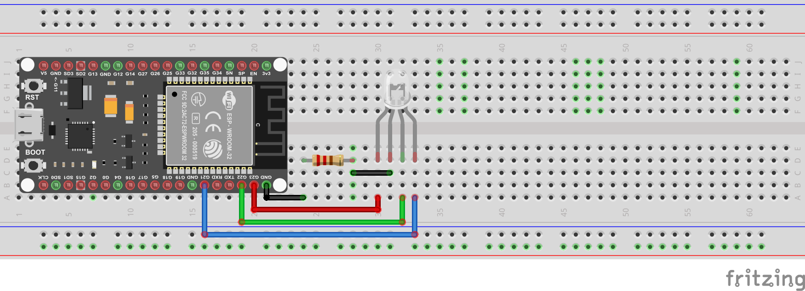

# Projeto: ESP32S e LED RGB

 

## Descrição
Neste projeto vamos controlar um LED RGB para emitir qualquer cor usando o ESP32.

## Introdução
O LED RGB pode emitir qualquer cor misturando as 3 cores básicas: vermelho, verde e azul. Um único LED RGB é composto por 3 LEDs: vermelho, verde e azul. Esses três LEDs são agrupados em um único invólucro, de modo que se pareçam com um único LED.

## Nota
De acordo com o pino comum, existem dois tipos de LED: anodo comum e catodo comum. Este tutorial utiliza um LED de cátodo comum.

## Como Funciona o LED RGB
Em termos de física, uma cor é uma combinação de três elementos de cor: Vermelho (R), Verde (G) e Azul (B). A faixa de valores de cada elemento de cor varia de 0 a 255. A combinação dos valores dos três elementos de cor cria um total de 256 x 256 x 256 cores.

Se gerarmos sinais PWM para os pinos R, G e B, o LED RGB exibirá uma cor correspondente aos valores do ciclo de trabalho PWM. Alterando o ciclo de trabalho dos sinais PWM (de 0 a 255), o LED RGB pode exibir qualquer cor. Os valores de cor Vermelho (R), Verde (G) e Azul (B) correspondem ao ciclo de trabalho PWM nos pinos R, G e B, respectivamente.

OBS.: O LED na animação acima é Anodo Comum.

## Pré-requisitos
* Ter a [IDE](https://www.arduino.cc/en/software/) do Arduino instalada e configurada;

## Material Necessário
* Microcontrolador ESP32 ou ESP32s;
* LED RGB Catodo comum;
* Protoboard e jumpers;
* Cabo de dados para conexão do microcontrolador ao PC.

## Tabela de Conexões
|Pinos do ESP32S|Pinos do LED RGB|
| :---: | :---: |
|GPIO23 (37)|RED (Vermelho)|
|GPIO22 (36)|GREEN (Verde)|
|GPIO21 (33)|BLUE (Azul)|
|GND (38)|COMUM|

## Imagem das Conexões

